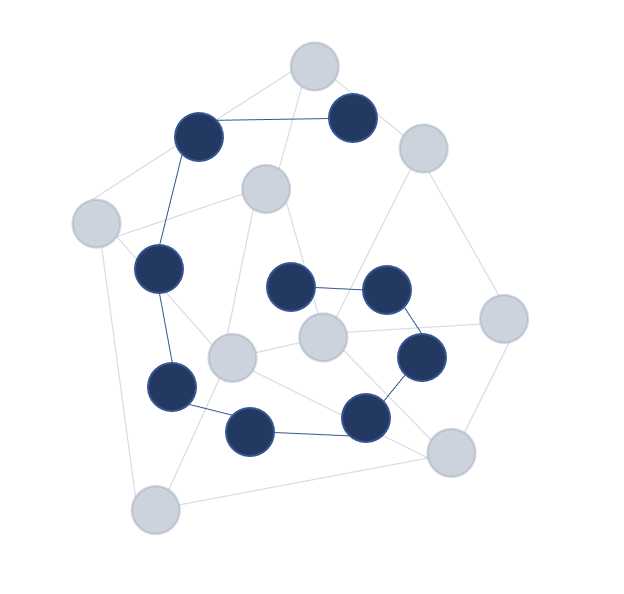

[](https://github.com/charliermarsh/ruff)
[](https://github.com/psf/black)
[](https://github.com/pre-commit/pre-commit)
[](https://github.com/alan-turing-institute/grace/actions)


# GRACE - Graph Representation Analysis for Connected Embeddings 🌐 📊 🤓




This `grace` repository contains a Python library 🐍 for identification of patterns in imaging data. The package provides a method 🖥️ to find connected objects & regions of interest in images by constructing graph-like representations 🌐 .

*Read more about:*
+ the [science](#science) behind this project 👩‍🔬👨‍🔬,
+ the [workflow](#workflow) of the individual steps 👩‍💻👨‍💻
+ don't forget to give us a '⭐' -> 😉

---

## Science

The acronym `grace` stands for __G__ raph __R__ epresentation __A__ nalysis for __C__ onnected __E__ mbeddings 📈📉. This tool was developed by researchers as a scientific project at The Alan Turing Institute in the [Data Science for Science programme](https://www.turing.ac.uk/research/research-programmes/data-science-science-and-humanities).

As the initial use case, we (see the [list of contributors](#contributors) below) developed `grace` for localising filaments in cryo-electron microscopy (cryoEM) imaging datasets as an image processing tool that automatically identifies filamentous proteins and locates the regions of interest, an accessory or binding protein.

Find out more details about the project aims & objectives [here](https://www.turing.ac.uk/research/research-projects/machine-learning-and-large-cryogenic-electron-microscopy-data-sets) & [here](https://www.turing.ac.uk/research/research-projects/molecular-structure-images-under-physical-constraints) or visit the [citation](#citation) panel below to check out the overarching research projects.

---

## Workflow

The `grace` workflow consists of the following steps:

1. Image data acquisition (_e.g._ cryo-electron microscopy)
2. Object detection via bounding boxes (_e.g._ crYOLO, RELION, or FasterRCNN)
3. Organisation of the bounding boxes into a 2D graphical structure
4. Latent feature extraction from image patches (_e.g._ pre-trained neural network, such as _ResNet-152_)
5. Classification of graph 'nodeness' and 'edgeness' confidence
6. *'Human-in-the-loop'* annotation of the desired pattern in the image data (see the [napari plugin](#development) below)
7. Combinatorial optimisation to connect the object nodes via edges
8. Evaluate the performance of the filament detection
9. Ta-da! 🥳

---

## Installation

`grace` has been tested with Python 3.8+ on OS X.

```sh
git clone https://github.com/alan-turing-institute/grace.git
cd ./grace
pip install -e .
```

## Development

🚧 **Work in progress** 🚧


This repository contains a few example notebooks, which will lead the user through the entire pipeline.

The image on the left shows a *napari*-based GUI widget for annotation of the desired filamentous proteins.

More details about how this type of graph representation analysis could be applied to image data processing will become available soon.

---

## Contributors

**Dataset generation (The University of Bristol):**

+ 👨‍🔬 [Marston Bradshaw](https://research-information.bris.ac.uk/en/persons/marston-bradshaw "Marston Bradshaw")
+ 👩‍🔬 [Danielle Paul](https://www.turing.ac.uk/people/researchers/danielle-paul "Danielle Paul")

**Software development (The Alan Turing Institute):**

+ 👩‍💻 [Beatriz Costa Gomes](https://github.com/mooniean "mooniean")
+ 👩‍💻 [Kristina Ulicna](https://github.com/KristinaUlicna "KristinaUlicna")
+ 👨‍💻 [Alan R Lowe](https://github.com/quantumjot "quantumjot")

...and many others...

---

## Citation

🚧 **Work in progress** 🚧

[](https://www.turing.ac.uk/research/research-projects/machine-learning-and-large-cryogenic-electron-microscopy-data-sets)

[](https://www.turing.ac.uk/research/research-projects/molecular-structure-images-under-physical-constraints)

We are writing up our methodology and key results, so please stay tuned for future updates!

In the meantime, please do not hesitate to let us know your suggestions for potential improvements by [raising an issue on GitHub](https://github.com/alan-turing-institute/grace/issues "Grace GitHub | Issues").

---

### _Happy graphing!_ 🎮
- Your GRACE development team 👋
- If you need any help, please don't...
