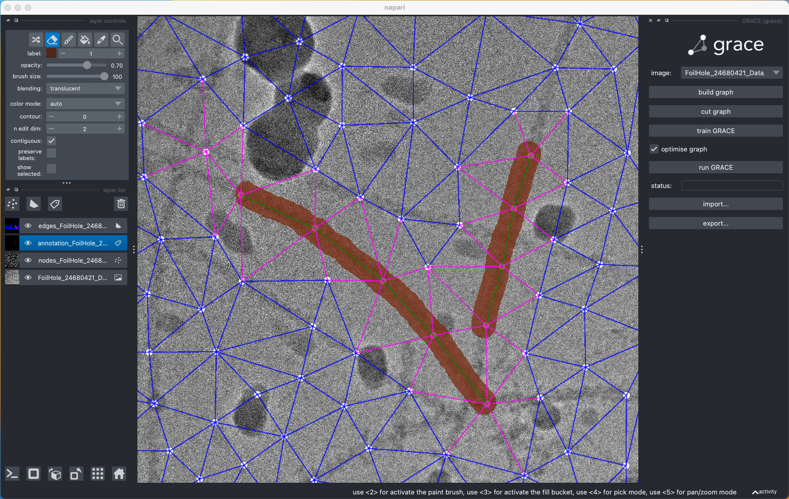
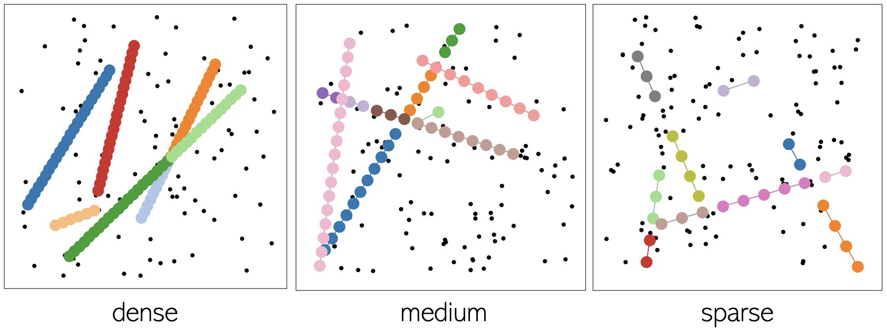

[](https://github.com/charliermarsh/ruff)
[](https://github.com/psf/black)
[](https://github.com/pre-commit/pre-commit)
[](https://github.com/alan-turing-institute/grace/actions)


# GRACE - Graph Representation Analysis for Connected Embeddings 🌐 📊 🤓


This `grace` repository contains a Python library 🐍 for identification of patterns in imaging data. The package provides a method 🖥️ to find connected objects & regions of interest in images by constructing graph-like representations 🌐 .

*Read more about:*
+ the [science](#science) behind this project 👩‍🔬👨‍🔬,
+ the [workflow](#workflow) of the individual steps 👩‍💻👨‍💻
+ the [contributors](#contributors) participating in the project design
    + how to bring in your own ideas
    + how to provide your feedback
+ don't forget to give us a '⭐' -> 😉

---


## Science

The acronym `grace` stands for  __G__ raph __R__ epresentation __A__ nalysis for __C__ onnected __E__ mbeddings 📈📉. This tool was developed by researchers as a scientific project at The Alan Turing Institute in the [Data Science for Science programme](https://www.turing.ac.uk/research/research-programmes/data-science-science-and-humanities).

As the initial use case, we (see the [list of contributors](#contributors) below) developed `grace` for localising filaments in cryo-electron microscopy (cryoEM) imaging datasets as an image processing tool that automatically identifies filamentous proteins and locates the regions of interest, an accessory or binding protein.

Find out more details about the project aims & objectives [here](https://www.turing.ac.uk/research/research-projects/machine-learning-and-large-cryogenic-electron-microscopy-data-sets) & [here](https://www.turing.ac.uk/research/research-projects/molecular-structure-images-under-physical-constraints) or visit the [citation](#citation) panel below to check out the overarching research projects.

---


## Workflow


The `grace` workflow consists of the following steps:

1. Image data acquisition (_e.g._ cryo-electron microscopy)
2. Object detection via bounding boxes (_e.g._ [crYOLO](https://cryolo.readthedocs.io/en/stable/), [RELION](https://github.com/3dem/relion), or [FasterRCNN](https://arxiv.org/pdf/1506.01497.pdf))
3. Organisation of the bounding boxes into a 2D graphical structure (_e.g._ [Delaunay triangulation](https://docs.scipy.org/doc/scipy/reference/generated/scipy.spatial.Delaunay.html))
4. Latent feature extraction from image patches (_e.g._ pre-trained neural network, such as [_ResNet-152_](https://pytorch.org/vision/main/models/generated/torchvision.models.resnet152.html))
5. *'Human-in-the-loop'* annotation of the desired pattern in the image data (see the [napari plugin](#development) below)
6. Classification of each 'nodeness' and 'edgeness' confidence via deep neural network classifiers
7. Combinatorial optimisation via integer linear programming (ILP) to connect the candidate object nodes via edges (see the [expected outcomes](#outcomes) below)
8. Quantitative evaluation of the filament detection performance
9. Ta-da! 🥳

---


## Installation

`grace` has been tested with Python 3.8+ on OS X.

For local development, clone the repo and install in editable mode:

```sh
git clone https://github.com/alan-turing-institute/grace.git
cd ./grace
pip install -e ".[dev]"
```

---


## Annotator GUI

Our repository contains a graphical user interface (GUI) which allows the user to manually annotate the regions of interests (motifs) in their cryo-EM data.

To try it out, make sure you've [installed](#installation) the repository & navigate to:

```sh
python examples/show_data.py
```

_Demonstration of the napari widget to annotate cryo-EM images._



The image on the left shows a *napari*-based GUI widget for annotation of the desired filamentous proteins.

More details about how this type of graph representation analysis could be applied to image data processing will become available soon.


### TODO: Add the compressed video demo:

_Demonstration of the napari widget to annotate cryo-EM images._

<!-- -->

<!---->
<!---->

<!---->


### TODO: Detail the documentation:

Here!

---


## Outcomes

🚧 **Work in progress** 🚧

The expected outcome of the `grace` workflow is to identify all connected objects as individual filament instances. We tested the combinatorial optimisation step on simulated data with 3 levels of 'line-seeding' densities: dense, medium and sparse.



As you can see, the optimiser works well to identify filamentous object instances simulated at various densities, and appears to work across object cross-overs (middle image, pink objects).

---


## Contributors

**Dataset generation (The University of Bristol):**

+ 👨‍🔬 [Marston Bradshaw](https://research-information.bris.ac.uk/en/persons/marston-bradshaw "Marston Bradshaw")
+ 👩‍🔬 [Danielle Paul](https://www.turing.ac.uk/people/researchers/danielle-paul "Danielle Paul")

**Software development (The Alan Turing Institute):**

+ 👩‍💻 [Beatriz Costa Gomes](https://github.com/mooniean "mooniean")
+ 👩‍💻 [Kristina Ulicna](https://github.com/KristinaUlicna "KristinaUlicna")
+ 👨‍💻 [Alan R Lowe](https://github.com/quantumjot "quantumjot")

...and many others...

If you'd like to contribute to our ongoing work, please do not hesitate to let us know your suggestions for potential improvements by [raising an issue on GitHub](https://github.com/alan-turing-institute/grace/issues "Grace GitHub | Issues").

---


## Citation

🚧 **Work in progress** 🚧

[](https://www.turing.ac.uk/research/research-projects/machine-learning-and-large-cryogenic-electron-microscopy-data-sets)

[](https://www.turing.ac.uk/research/research-projects/molecular-structure-images-under-physical-constraints)


We are currently writing up our methodology and key results, so please stay tuned for future updates!

In the meantime, please use the template below to cite our work:

```
@unpublished{grace_repository,
    year = {2023},
    month = {April},
    publisher = {{CCP-EM} Collaborative Computational Project for Electron cryo-Microscopy},
    howpublished = {Paper presented at the 2023 {CCP-EM} Spring Symposium},
    url = {https://www.ccpem.ac.uk/downloads/symposium/ccp-em_symp_schedule_2023.pdf},
    author = {Beatriz Costa-Gomes, Kristina Ulicna, Christorpher Soelistyo, Marjan Famili, Alan Lowe​},
    title = {Deconstructing cryoEM micrographs with a graph-based analysis for effective structure detection},
    abstract = {Reliable detection of structures is a fundamental step in analysis of cryoEM micrographs.
    Despite intense developments of computational approaches in recent years, time-consuming hand annotating
    remains inevitable and represents a rate-limiting step in the analysis of cryoEM data samples with
    heterogeneous objects. Furthermore, many of the current solutions are constrained by image characteristics:
    the large sizes of individual micrographs, the need to perform extensive re-training of the detection models
    to find objects of various categories in the same image dataset, and the presence of artefacts that might
    have similar shapes to the intended targets.
    To address these challenges, we developed GRACE (Graph Representation Analysis for Connected Embeddings),
    a computer vision-based Python package for identification of structural motifs in complex imaging data.
    GRACE sources from large images populated with low-fidelity object detections to build a graph representation
    of the entire image. This global graph is then traversed to find structured regions of interest via extracting
    latent node representations from the local image patches and connecting candidate objects in a supervised manner
    with a graph neural network.
    Using a human-in-the-loop approach, the user is encouraged to annotate the desired motifs of interest, making
    our tool agnostic to the type of object detections. The user-nominated structures are then localised and
    connected using a combinatorial optimisation step, which uses the latent embeddings to decide whether the
    graph nodes belong to an object instance.
    Importantly, GRACE reduces the search space from millions of pixels to hundreds of nodes, which allows for
    fast and efficient implementation and potential tool customisation. In addition, our method can be repurposed
    to search for different motifs of interest within the same dataset in a significantly smaller time scale to
    the currently available open-source methods. We envisage that our end-to-end approach could be extended to
    other types of imaging data where object segmentation and detection remains challenging.}
}
```

---

### _Happy graphing!_ 🎮
- Your GRACE development research team 👋
