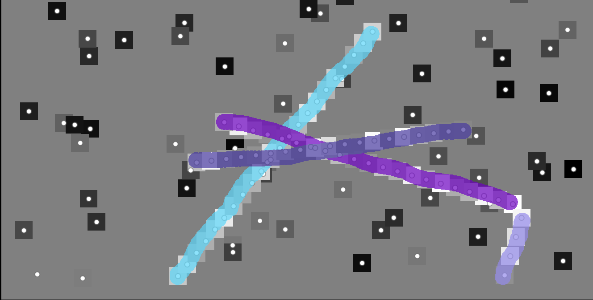

# Evaluation of GRACE performance 📊

To compute the performance on random graphs, we perform two types of evaluation:

1. **quantitative metrics** - numerical scores such as node & edge accuracy, precision, recall, f-score, and semantic- as well as instance-level intersection over union (IoU)
2. **qualitative visualisation** - bounding boxes overlay of individual objects identified in the graph between predicted (optimised) and ground truth (hand-annotated) graphs.

*Note:* Area under curve (AUC) or precision-recall curve metrics are not applicable here, because the optimisation step 'strips off' the probabilities of predictions - all decisions here, _i.e._ to accept or reject a hypothesis of an existing node / edge, are of binary nature, as all-or-nothing. The optimiser doesn't think that an edge is accepted with a certain probability, it just accepts or rejects it and it's decision is final.

## Why evaluate at this point?

The rationale behind evaluating the per-node and per-edge metrics at this stage is that the optimisation step can (and most likely will) change the identities of the individual nodes / edges when looking for a globally optimal solution. For example, a single node could be predicted (by the GCN / classification method of choice) to have a high probability of being considered a real node (true positive, TP), but if such node is surrounded by no other plausible nodes or forms no acceptable edges, it has a high likelihood to be considered a fake node (true negative, TN) in favour of the global optimisation. This is why evaluation of the node- & edge-specific metrics is vital to observe the changes made to the graph components as a result of the optimisation step. The results may differ from evaluation after GCN inference.

*Note:* Our entire GRACE method assumes that **the real object must form an edge**, _i.e._ that a real object cannot exist as an isolated node. This is an **assumption* we are making, not a universal truth. For example, when detecting filamentous objects, such as roads in an image, it is unlikely that only a single local detection would correspond to a road. But this possibility cannot be excluded, for example if the road leads to a tunnel from one side and an airplane flew over it from the other side (2 different types of _object occlusion_). With our methodology, this isolated detection would not be considered a self-standing object.

## Types of metrics

### *Exact*

The metrics which are referenced to as **exact** measure similarity between two graphs formed of identical node count which have equal positions on each graph. The only thing that differs between the graphs is the edges and object membership / individual identities. The exact metrics compare the connected components from the graphs and the agreement between them.

Ground Truth Graph                       | Optimised Prediction
:--------------------------------------: | :--------------------------------------:
 | 

### *Approximate*

When (particle picking) detections are unavailable, one may wish to construct a graph with random detections (*i.e.* nodes) at a certain density to learn where objects are present. In such case, one may want to measure the similarity between the ground truth annotation (*i.e. binary mask from napari) and a predicted mask created from an optimised graph. Althought the IoU metrics (see below) are defined similarly, they are evaluated by finding the intercept between the two masks and not the connected components from the graphs anymore.

Hand-Annotated Ground Truth Mask        | Auto-Computed Predicted Objects
:-------------------------------------: | :-------------------------------------:
 | 

## Intersection-over-union (IoU)

In the **exact** metric formulation, the IoU is calculated purely on the individual object (=connected component) level, using only the node indices of those connected components. Therefore, the edge-specific information can be discarded at this point.

### *Semantic* IoU

The semantic IoU is set to assume that all objects which are real are of the **same identity**, for example, 1. This is how our napari annotator GUI works - it only allows the annotation of one class of objects. If the objects in the annotation are *touching*, there is no way how to automatically distinguish between their masks & assign them into multiple objects. The semantic IoU calculation *simplifies the calculation by assuming* that all objects are touching.

### *Instance* IoU

Here, all objects are **considered independently**, unless touching (as described above). Currently, this is the most accurate metric to determine the performance of our GRACE methodology.

## Mean Squared Displacement (MSD)

### 🚧 [WIP] Currently not implemented 🚧

IoU and MSD are two different metrics used for evaluating object detection tasks. IoU is generally considered a **better metric for object detection** than MSD for several reasons:

* *Relevance to Overlapping Objects:* IoU is specifically designed to measure the overlap between the predicted bounding box and the ground truth bounding box of an object. This is highly relevant in object detection tasks, where the goal is to accurately localize objects within an image.

* *Alignment with Detection Objective:* Object detection aims to determine the accurate spatial extent of objects in an image. IoU directly quantifies the overlap between the predicted and ground truth bounding boxes, which aligns well with the objective of correctly identifying objects and their positions.

* Thresholding and Threshold Independence:* IoU is often used as a threshold-based metric to determine whether a prediction is a true positive, false positive, or false negative. It offers a clear threshold for deciding whether a detection is successful or not. MSD does not have a natural thresholding mechanism and may not be as intuitive for setting detection thresholds.

* *Detection Score:* IoU can be used to compute detection scores such as precision, recall, and F1-score. These scores provide insights into the trade-off between false positives and false negatives, which is essential for evaluating the performance of object detectors.

* *Localization Accuracy:* Object detection not only requires accurate object presence detection but also precise localization. IoU directly measures the quality of localization by considering the overlap area between the predicted and ground truth bounding boxes.

* *Standard Evaluation Metric:* IoU is a widely used and standard evaluation metric in the field of object detection. Many benchmark datasets and competitions use IoU-based metrics to rank and compare different object detection methods.

On the other hand, MSD is generally used in different contexts, such as tracking or analyzing movement patterns. It measures the mean squared distance between predicted and ground truth object positions, which might not be as directly relevant to the main objective of object detection. While both metrics have their merits, IoU is more aligned with the specific requirements and goals of object detection tasks.

## [WIP] 🚧 Multiclass metric evaluation

Our napari-based annotator GUI provides an option to annotate objects _instantenously_, _i.e._ with a unique value brush per object. This is in contrast to labelling objects _semantically_, _i.e._ with a single-valued brush, producing a binary mask.

Multiclass image annotation in *napari* |
:-------------------------------------: |
 |

However, our current GRACE implementation only allows differentiation between **objects belonging to a single type**. This could/should be addressed in later developments.

___
