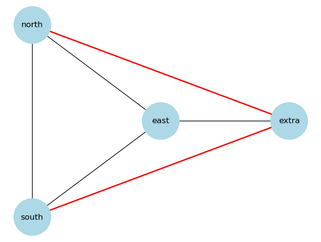

# Graph Attributes for Classification

## Node features:

The nodes in the constructed graph are processed via an image feature extractor model, _e.g._ `ResNet-152` pre-trained with `ImageNet` weights, to crop a small patch centred at the node's (`x`, `y`) coordinates as the specified shape (_i.e._ `bbox_size`).

The node-corresponding patches are then run through the forward pass of the model, which has its last fully-connected (FC) classification layer chopped of to return a 1D vector of image embeddings. The embedding dimension depends on the feature extractor of choice; for instance, the `ResNet-152` will output 2,048 features-long vector. These embeddings provide an **hypothesis-free approach** to describe the images without incorporation of user's prior about what is or isn't important to featurize in the image patch data. In GRACE, the node features are stored as `GraphAttrs.NODE_FEATURES` array.  


## Edge properties:

The edges are characterised for their geometrical properties using an `EdgePropertyCruncher` to compute the edge's length (in pixels), orientation with respect to the vertical plane (in degrees & radians), and immediate neighbourhood characteristics.

Although the edges in GRACE are *undirected*, each edge is positioned to orient its `src` (source) node to the **south**, and its `dst` (destination) node to the **north**, to guarantee a conserved way of neighbourhood description. Because the graph is defined to be a [Delaunay triangulation](https://en.wikipedia.org/wiki/Delaunay_triangulation) among all available nodes, each edge forms a maximum of 2 neighbourhood triangles - one to the `left` of the edge, _i.e._ with the **west** neighbour, and one to the `right` of the edge, _i.e._ with the **east** neighbour. The east & west neighbour nodes are found by looking at the interception between the nodes that the `src` and the `dst` nodes form an edge with. In exceptional cases, an edge only forms:



1. One triangle, _i.e._ when the edge in at the boundary of the image / triangulated system; or
1. More than 2 triangles in case there is an extra overarching node. This condition is caught in the code & it is guaranteed to only include the closest neighbour for triangle are consideration. See the schematic below:


There is currently a set of 36 calculated edge properties, which can be categorised into various categories, as described below.


### Positional properties:

#### Absolute:

Raw positional information of the points on the graph [in pixels], together with the position of the edge midpoint:

```sh
SOUTH_POS_X_RAW = "south_pos_x_raw"
SOUTH_POS_Y_RAW = "south_pos_y_raw"
NORTH_POS_X_RAW = "north_pos_x_raw"
NORTH_POS_Y_RAW = "north_pos_y_raw"
EAST_POS_X_RAW = "east_pos_x_raw"
EAST_POS_Y_RAW = "east_pos_y_raw"
WEST_POS_X_RAW = "west_pos_x_raw"
WEST_POS_Y_RAW = "west_pos_y_raw"
MID_POS_X_RAW = "mid_pos_x_raw"
MID_POS_Y_RAW = "mid_pos_y_raw"
```


#### Relative:

To standardise the pixel position which is dependent on the underlying image shape, these properties are additionally 0-1 standardized for versatility:

```sh
SOUTH_POS_X_REL = "south_pos_x_rel"
SOUTH_POS_Y_REL = "south_pos_y_rel"
NORTH_POS_X_REL = "north_pos_x_rel"
NORTH_POS_Y_REL = "north_pos_y_rel"
EAST_POS_X_REL = "east_pos_x_rel"
EAST_POS_Y_REL = "east_pos_y_rel"
WEST_POS_X_REL = "west_pos_x_rel"
WEST_POS_Y_REL = "west_pos_y_rel"
MID_POS_X_REL = "mid_pos_x_rel"
MID_POS_Y_REL = "mid_pos_y_rel"
```


### Geometrical properties:

The properties which further describe the edge geometry are bound to lengths (=distances):

```sh
EDGE_LENGTH_RAW = "edge_length_raw"
EAST_TO_MID_LENGTH_RAW = "east_to_mid_length_raw"
WEST_TO_MID_LENGTH_RAW = "west_to_mid_length_raw"
EAST_TRIANGLE_AREA_RAW = "east_triangle_area_raw"
WEST_TRIANGLE_AREA_RAW = "west_triangle_area_raw"
```

and edge orientation, _i.e._ the angle with the vertical plane:

```sh
EDGE_ORIENT_RAD = "edge_orient_rad"
EDGE_ORIENT_DEG = "edge_orient_deg"
EAST_TO_MID_ORIENT_RAD = "east_to_mid_orient_rad"
WEST_TO_MID_ORIENT_RAD = "west_to_mid_orient_rad"
```

### Scaling the properties:

The properties **normalisation** is defined as:

$$ prop_{nrm} = {prop_{raw} \over mean(\{prop_{raw}1, prop_{raw}2, ..., prop_{raw}N\})} $$

and concerns these properties:

```sh
EDGE_LENGTH_NRM = "edge_length_nrm"
WEST_TO_MID_LENGTH_NRM = "west_to_mid_length_nrm"
EAST_TO_MID_LENGTH_NRM = "east_to_mid_length_nrm"
WEST_TRIANGLE_AREA_NRM = "west_triangle_area_nrm"
EAST_TRIANGLE_AREA_NRM = "east_triangle_area_nrm"
```

The properties **relativisation** is defined as:

$$ distance_{rel} = {distance_{raw} \over distance_{edge}} $$

where distance between neighbour node & edge midpoint is divided by distance between `src` and `dst` nodes, and concerns these length-based properties:

```sh
WEST_TO_MID_LENGTH_REL = "west_to_mid_length_rel"
EAST_TO_MID_LENGTH_REL = "east_to_mid_length_rel"
```

### Properties storage & processing:

To store the edge properties appropriately, the `dataclass` object `Properties` allows the storage & correct packaging of the edge keys & corresponding values into a dictionary, which forms the `GraphAttrs.EDGE_PROPERTIES`. More details can be found in the [grace/base.py](../base.py) module.


## Property choice for classifier training:

For classifier training purposes, one should restrain to use only the:

+ normalised geometrical properties;
+ relative edge-to-neighbour distances;
+ orientation angles in radians.

These properties will ensure that the ranges are not considered in raw pixel values / degrees, which could lead to unstable training.


### Including the positional coordinates

Although the `EdgePropertyCruncher` allows the calculation of positional coordinates of selected points on the graph, it is not recommended to supply these value as input into the training as the classifier could **memorise** the positions of the objects, as opposed to actually **learning** the descriptors which _constitute a true edge_. For instance, such classifier could be prompted to score edges in the upper left corner of the image as true positive if it experienced objects to be present in that region of the image from the training data, leading to false predictions.
